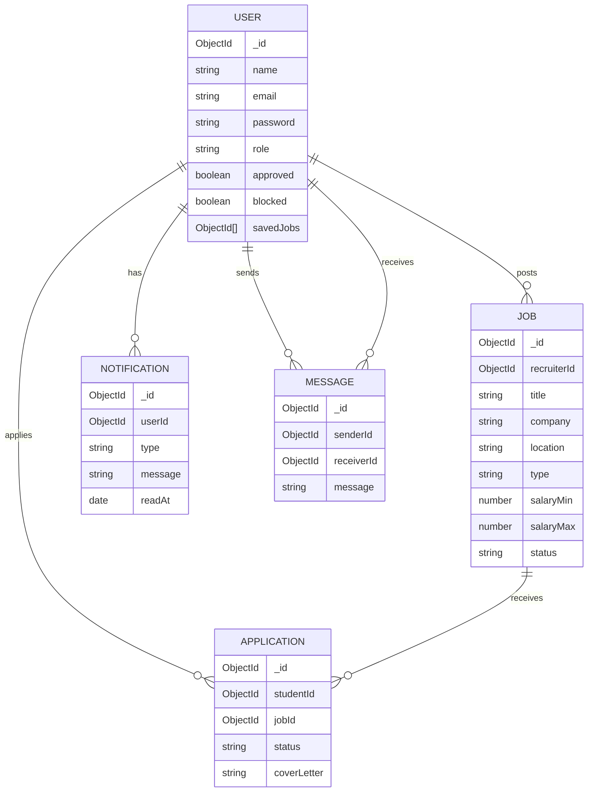
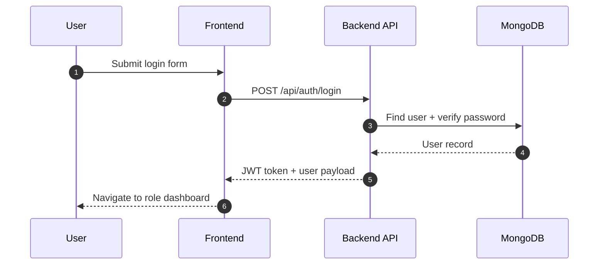
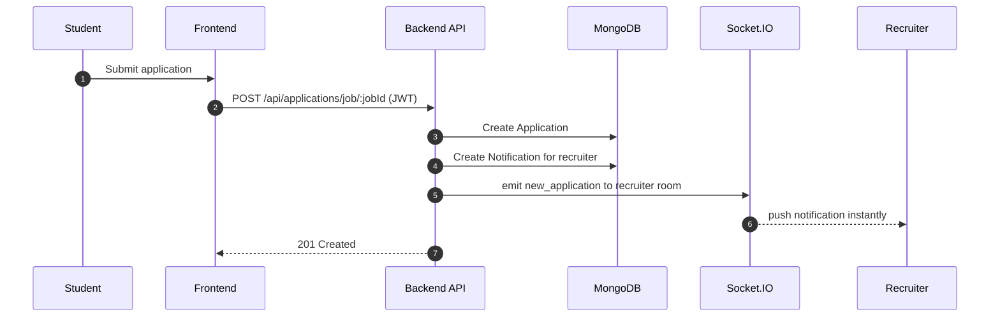
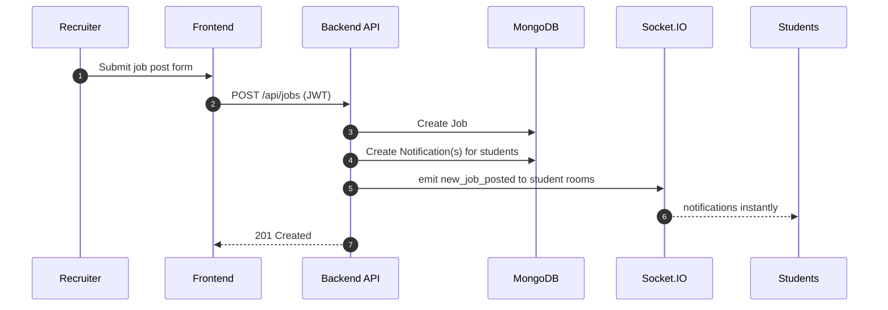

# CareerConnect Job Board System

A full‑stack job board platform built with **React (Vite)**, **Node.js/Express**, and **MongoDB**. CareerConnect supports **students**, **recruiters**, and **admins** with role‑based access, job posting & applications, saved jobs, real‑time notifications, and real‑time chat.

- **Demo**: _Coming soon_ (add deployed URLs here)
  - **Frontend (Vercel)**: _TBD_
  - **Backend (Render)**: _TBD_

## Tech Stack

- **Frontend**: React 18, Vite 5, React Router, Axios
- **Backend**: Node.js (ESM), Express, Mongoose, JWT Auth
- **Database**: MongoDB
- **Realtime**: Socket.IO
- **Validation**: Zod (request validation)
- **Uploads**: Multer (secure file type + size limits)

## Key Features

- **Authentication & Authorization**
  - JWT authentication
  - Role‑based access control (**student**, **recruiter**, **admin**)
  - Recruiter approval workflow
  - Blocked user enforcement
- **Jobs**
  - Create, update, delete jobs (recruiters)
  - Browse jobs (students)
  - **Pagination + filtering** on job list
- **Applications**
  - Apply with cover letter
  - Recruiters view applicants and update status
- **Saved Jobs**
  - Students can bookmark jobs and manage a Saved Jobs list
- **Notifications**
  - Stored server‑side, unread count + mark as read
  - **Real‑time delivery** via Socket.IO events
- **Chat**
  - 1‑to‑1 messaging between student and recruiter
  - Real‑time message delivery via Socket.IO
- **Admin Analytics**
  - Real MongoDB counts and last‑30‑day activity stats

---

## Purpose & Scope

CareerConnect is designed to streamline early‑career hiring workflows:

- Students can discover and apply to opportunities, manage their profile, and keep a shortlist of jobs.
- Recruiters can publish job openings, review applicants, and communicate with candidates.
- Admins can oversee platform activity, approve recruiters, and manage users.

This repository contains both the frontend and backend services required to run the system locally and deploy it to production.

## System Overview

The system is split into two applications:

- **Frontend** (React/Vite): user interface, routing, and API integration.
- **Backend** (Express/MongoDB): authentication, business logic, data access, uploads, and realtime sockets.

### Roles

- **Student**
  - Browse jobs, save jobs, apply to jobs
  - View applications and statuses
  - Update profile and upload resume/avatar
- **Recruiter**
  - (After admin approval) post jobs and manage jobs
  - View applicants, accept/reject applications
  - Message students (chat)
- **Admin**
  - View analytics dashboard
  - Manage users (approve recruiters, block users)

## Use Case Scenarios (High‑Level)

- **Login**
  - User logs in → receives JWT → frontend stores token → protected routes unlock based on role.
- **Apply to a job**
  - Student submits cover letter → application stored → recruiter receives notification (realtime).
- **Post a job**
  - Recruiter posts job → job stored → all students receive notification (realtime).
- **Update application status**
  - Recruiter accepts/rejects → student receives notification (realtime).
- **Chat**
  - Recruiter opens applicants → selects student → messages in real time.

---

## Visual Documentation (Mermaid Diagrams)

### System Architecture

```mermaid
graph TD
  A[Browser / React (Vite)] -->|HTTPS REST /api| B[Express API]
  A -->|Socket.IO| S[Socket Server]
  B --> D[(MongoDB)]
  B --> U[/Uploads Folder/]
  S --> B
```

### Database ER Diagram



### Sequence Diagrams

#### Login



#### Apply to a Job + Notification Flow



#### Post a Job + Broadcast to Students



---

## User Interface Preview

Add screenshots to `./screenshots/` and update the file names below.


---

## API Summary (Core Endpoints)

| Method | Endpoint | Description | Auth |
| ------ | -------- | ----------- | ---- |
| POST | `/api/auth/register` | Register user | Public |
| POST | `/api/auth/login` | Login user | Public |
| GET | `/api/auth/me` | Current user profile | JWT |
| GET | `/api/jobs` | List jobs (pagination + filters) | Public |
| GET | `/api/jobs/:id` | Job details | Public |
| POST | `/api/jobs` | Create job | JWT (Recruiter/Admin) |
| PUT | `/api/jobs/:id` | Update job | JWT (Recruiter/Admin) |
| DELETE | `/api/jobs/:id` | Delete job | JWT (Recruiter/Admin) |
| POST | `/api/applications/job/:jobId` | Apply for job | JWT (Student) |
| GET | `/api/applications/student/my-applications` | Student applications | JWT (Student) |
| GET | `/api/applications/job/:jobId/applicants` | Job applicants | JWT (Recruiter/Admin) |
| PUT | `/api/applications/:id/status` | Update application status | JWT (Recruiter/Admin) |
| POST | `/api/jobs/:id/save` | Save/bookmark job | JWT (Student) |
| DELETE | `/api/jobs/:id/save` | Unsave job | JWT (Student) |
| GET | `/api/users/saved-jobs` | Saved jobs list | JWT (Student) |
| GET | `/api/notifications` | List notifications | JWT |
| GET | `/api/notifications/unread-count` | Unread count | JWT |
| PUT | `/api/notifications/mark-all-read` | Mark all read | JWT |
| GET | `/api/messages/:userId` | Conversation messages | JWT |
| POST | `/api/messages/:userId` | Send chat message | JWT |
| GET | `/api/stats/admin` | Admin stats | Public (recommended: admin-only) |

> Note: For production hardening, `/api/stats/admin` should be restricted to admin role.

---

## Error Handling & Status Codes

The API uses consistent JSON error responses (global error handler).

Common status codes:

- **200 OK**: Successful request
- **201 Created**: Resource created (job, application, message)
- **400 Bad Request**: Validation failure (Zod) or malformed input
- **401 Unauthorized**: Missing/invalid JWT, role middleware failures
- **403 Forbidden**: Blocked user or forbidden role action
- **404 Not Found**: Missing resource
- **500 Server Error**: Unexpected error

Example validation error format:

```json
{
  "message": "Validation error",
  "errors": [
    { "path": "email", "message": "Required" }
  ]
}
```

---

## Security (Expanded)

- **JWT Authentication**
  - Token returned on login/register
  - Sent via `Authorization: Bearer <token>`
- **Role‑based Authorization**
  - Students, recruiters, and admins have different route permissions
  - Recruiters are gated by an `approved` flag (admin workflow)
- **Blocked Users**
  - Blocked users are denied protected endpoints
- **Request Validation**
  - Zod schemas validate critical endpoints (auth, jobs, applications, messages)
- **Secure File Uploads**
  - Avatar: jpg/png/webp, max **2MB**
  - Resume: pdf/doc/docx, max **5MB**
- **Future Improvements**
  - Rate limiting (login/register)
  - Helmet security headers
  - Audit logs for admin actions
  - CSRF strategy if cookies are introduced

---

## Performance & Scalability

- **Pagination**
  - `GET /api/jobs` supports `page` and `limit`
- **Filtering**
  - Keyword search + location/type/salary filters are done at DB level
- **Indexing (Recommended)**
  - Add indexes on `Job.createdAt`, `Job.location`, `Job.type`, `Application.jobId`, `Application.studentId`
- **Future: Caching**
  - Redis caching for frequent queries (jobs list, unread counts)
- **Large Data Handling**
  - Limit notification list size
  - Add cursor-based pagination for messages if volume increases

---

## Project Structure

```text
Backend/
  controllers/
  middleware/
  models/
  routes/
  validators/
  uploads/
  server.js

Frontend/
  src/
    components/
    context/
    pages/
    routes/
    utils/
  vite.config.ts
```

---

## Environment Variables

### Backend (`Backend/.env`)

```env
PORT=5000
NODE_ENV=production
MONGODB_URI=
JWT_SECRET=
CORS_ORIGINS=https://your-frontend.vercel.app
```

### Frontend (`Frontend/.env`)

```env
VITE_API_BASE_URL=https://your-backend.onrender.com/api
VITE_SOCKET_URL=https://your-backend.onrender.com
```

---

## Local Development

### Backend

```bash
cd Backend
npm install
npm run dev
```

### Frontend

```bash
cd Frontend
npm install
npm run dev
```

---

## Deployment Guide

### Backend (Render)

1. Create a Render **Web Service**
2. Root directory: `Backend`
3. Build command: `npm install`
4. Start command: `npm start`
5. Add env vars in Render:
   - `MONGODB_URI`
   - `JWT_SECRET`
   - `CORS_ORIGINS=https://YOUR-FRONTEND.vercel.app`

You can also use the included `render.yaml`.

### Frontend (Vercel)

1. Import repo to Vercel
2. Set **Root Directory** to `Frontend`
3. Build command: `npm run build`
4. Output directory: `dist`
5. Set env vars:
   - `VITE_API_BASE_URL=https://YOUR-RENDER-SERVICE.onrender.com/api`
   - `VITE_SOCKET_URL=https://YOUR-RENDER-SERVICE.onrender.com`

`Frontend/vercel.json` ensures SPA routing works.

---

## Future Improvements

- Real conversation list UI (inbox) + unread message counts
- Recommendation system (personalized jobs)
- Email notifications (SendGrid/Mailgun)
- Resume parsing + job matching
- Admin moderation queue for jobs
- Full analytics charts (time series)

---

## Contributing

1. Fork the repository
2. Create a feature branch:
   - `git checkout -b feature/my-feature`
3. Run locally (see Local Development)
4. Submit a Pull Request with:
   - Summary of changes
   - Screenshots (UI changes)
   - Test steps

### Development guidelines

- Keep changes small and focused
- Prefer shared utilities over copy/paste
- Validate inputs for new endpoints (Zod)
- Add clear error messages and consistent response formats


